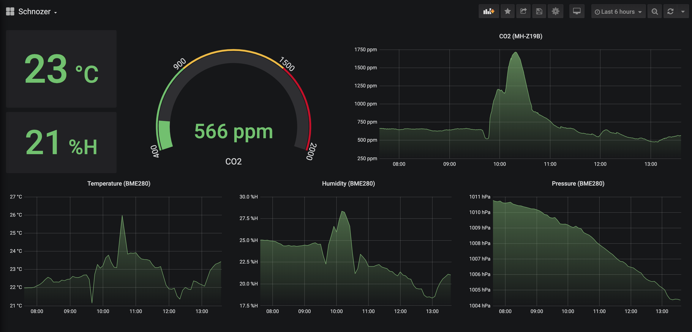

# Schnozer :nose:

Chronograf (https://github.com/influxdata/chronograf) on the screenshot above, can be viewed live on https://olegy.kz/

Raspberry-PI-based solution to analyze the air quality (CO2, temperature, humidity, pressure)

# How it works :gear:
* For humidity, temperature and pressure data I'm using BME280 sensor;
* CO2 :biohazard: concentration data is provided by MH-Z19B sensor;
* `sniff.rb` script execution sends single measurement to local Telegraf instance;
* For continuos monitoring `sniff.rb` execution should be executed by external scheduling system (CRON, for instance)

# Wiring
TODO

# Data utilization :bar_chart:
Obtained values are reported to the local Telegraf instance - then they could be utilized in
according to Telegraf configuration file. In my case, I'm using InfluxDB as telegraf output and
Chronograf as UI for InfluxDB

# Credits :clap:
* BME280 code is based on https://github.com/kochka/ruby_rpi_components
* MH-Z19B code is based on https://github.com/cho45/ruby-mh-z19
* Influxdata (https://github.com/influxdata/) for InfluxDB, Telegraf, Chronograf
